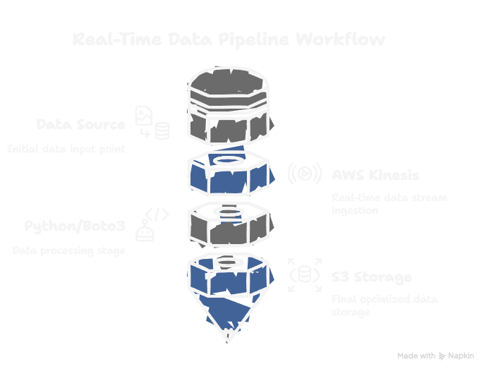

# Real-Time Data Pipeline with AWS Kinesis and Python

## Overview
This project builds a real-time data pipeline using AWS Kinesis, Python, and S3. It simulates streaming data (e.g., fake tweets or bomb threat logs) and processes it instantly, storing results in the cloud. It’s designed to showcase skills in cloud computing, Python, and event-driven systems—perfect for tackling scenarios like the 2024 India hoax bomb threats.

### Features
- **Producer**: Generates fake tweets and sends them to a Kinesis stream.
- **Consumer**: Reads the stream in real time, processes data, and saves it to S3.
- **Tech Stack**: Python, AWS Kinesis, AWS S3, `boto3` library.

## Prerequisites
- Python 3.8+
- AWS account (free tier works)
- AWS CLI installed and configured (`aws configure`)
- Required Python library: `pip install boto3`

## Setup Instructions
1. **Create AWS Resources**:
   - **Kinesis Stream**: In AWS Console > Kinesis, create a stream named `TweetStream` with 1 shard.
   - **S3 Bucket**: In AWS Console > S3, create a bucket (e.g., `my-tweet-bucket`) in the same region (e.g., `us-east-1`).

2. **Configure AWS Credentials**:
   - Run `aws configure` in terminal with your Access Key, Secret Key, region (e.g., `us-east-1`), and output format (`json`).

3. **Run the Project**:
   - Open two terminals in the project folder:
     - Terminal 1: `python producer.py` (sends data to Kinesis).
     - Terminal 2: `python consumer.py` (reads and saves to S3).
   - Check S3 for files like `threat_Alice_1711234567.json`.

## Files
- `producer.py`: Generates and streams fake tweets to Kinesis.
- `consumer.py`: Processes the stream and stores data in S3.

## How it works

## Use Case Example
This pipeline could analyze real-time bomb threat data (e.g., 2024 India hoax threats):
- Streams threats from social media or logs.
- Spots patterns (e.g., frequent targets like IndiGo or spikes before holidays).
- Saves data for later investigation.

## Future Improvements
- Add real-time alerts via AWS SNS.
- Analyze patterns (e.g., count threats per user).
- Visualize data with AWS QuickSight.

## Note
AWS Kinesis costs ~$3.64(Rs.301.76)/month beyond free tier (1 shard-hour). Delete stream after testing—watch those charges!
Please note that AWS Kinesis is a paid service even for a free tier account. Make sure you terminate the above mentioned scripts
on your terminal so as to avoid any unnecessary charges.

## License
This project is licensed under the MIT License - see the [LICENSE](LICENSE) file for details.
