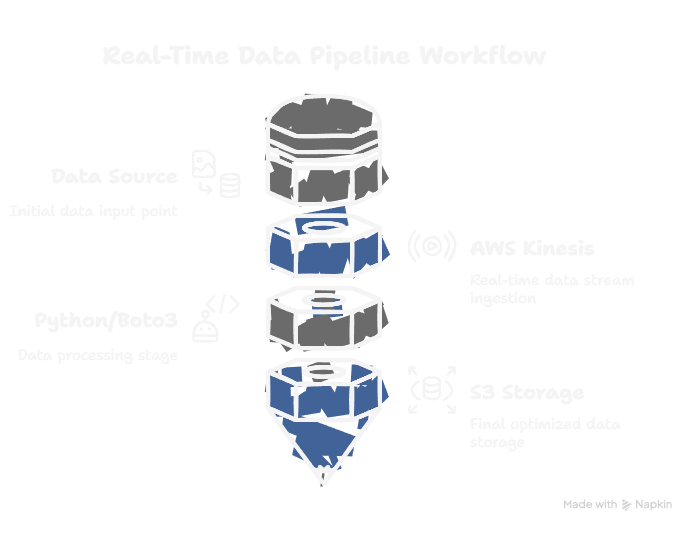

<div align="center">

# ⚡ Real-Time Data Pipeline with AWS Kinesis & Python

### A Cloud-Native Event Streaming Pipeline for Processing Live Data using AWS Kinesis, Amazon S3 & Python


*A scalable real-time streaming application that simulates live event data, processes it instantly using Amazon Kinesis, and stores the processed output in Amazon S3.*

</div>

---

# 📖 Project Overview

Modern applications generate millions of events every second—from financial transactions and IoT devices to social media feeds and cybersecurity logs. Processing this data in real time is essential for monitoring, analytics, and rapid decision-making.

This project demonstrates a **real-time event-driven data pipeline** built completely on **AWS Cloud Services**. A Python producer continuously generates fake streaming events and sends them to **Amazon Kinesis Data Streams**. A Python consumer immediately processes these events and stores them as JSON files in **Amazon S3**, creating a lightweight yet scalable streaming architecture.

This project showcases practical cloud engineering concepts including:

- ☁️ Event-driven Architecture
- ⚡ Real-Time Stream Processing
- 📡 Data Streaming with Amazon Kinesis
- 🐍 Python AWS SDK (Boto3)
- 📦 Cloud Storage using Amazon S3
- 🔄 Producer–Consumer Architecture

---

# ✨ Features

✅ Generate live streaming data using Python

✅ Publish events to Amazon Kinesis Data Streams

✅ Consume streaming data in real time

✅ Store processed events in Amazon S3

✅ Fully serverless AWS architecture

✅ Easily extendable for analytics, dashboards, or ML pipelines

---

# 🛠️ Tech Stack

| Technology | Purpose |
|------------|---------|
| 🐍 Python | Event Producer & Consumer |
| ☁️ Amazon Kinesis | Real-Time Data Streaming |
| 📦 Amazon S3 | Persistent Cloud Storage |
| 🔗 Boto3 | AWS SDK for Python |
| 💻 AWS CLI | Authentication & Configuration |

---

# 📂 Project Structure

```text
Real-Time-Data-Pipeline/
│
├── producer.py          # Generates fake streaming events
├── consumer.py          # Reads Kinesis stream and uploads to S3
├── datapipeline.png     # Architecture diagram
├── README.md
└── LICENSE
```

---

# ⚙️ Prerequisites

Before running the project, ensure you have:

- Python 3.8+
- AWS Account
- AWS CLI installed
- Configured AWS credentials
- boto3 installed

Install dependencies:

```bash
pip install boto3
```

Configure AWS credentials:

```bash
aws configure
```

Provide:

- Access Key ID
- Secret Access Key
- Region (example: us-east-1)
- Output format (json)

---

# 🚀 AWS Resource Setup

## 1️⃣ Create an Amazon Kinesis Stream

Navigate to:

```
AWS Console
→ Amazon Kinesis
→ Data Streams
→ Create Stream
```

Example configuration:

```
Stream Name : TweetStream
Shards      : 1
```

---

## 2️⃣ Create an Amazon S3 Bucket

Navigate to:

```
AWS Console
→ Amazon S3
→ Create Bucket
```

Example:

```
Bucket Name:
my-tweet-bucket
```

Ensure the bucket is created in the **same AWS Region** as the Kinesis stream.

---

# ▶️ Running the Project

Open **two terminals** inside the project folder.

### Terminal 1

Run the Producer

```bash
python producer.py
```

This continuously generates fake tweets and streams them to Amazon Kinesis.

---

### Terminal 2

Run the Consumer

```bash
python consumer.py
```

The consumer reads incoming records and stores them inside Amazon S3.

Example output:

```
threat_Alice_1711234567.json
threat_John_1711234578.json
```

---

# 🔄 Architecture Workflow

<p align="center">

</p>

The pipeline follows a classic Producer–Consumer architecture:

```
Producer.py
      │
      ▼
Amazon Kinesis Data Stream
      │
      ▼
Consumer.py
      │
      ▼
Amazon S3 Bucket
```

---

# 🌍 Real-World Use Case

This project was inspired by the surge of **hoax bomb threat incidents affecting Indian airlines**, where hundreds of suspicious messages required rapid analysis.

The pipeline can easily be adapted to:

✈️ Stream airport or airline security alerts

📱 Monitor live social media feeds

🚨 Detect spikes in suspicious activities

📊 Identify frequent targets or recurring users

🗂️ Archive streaming events for forensic investigation

The same architecture is commonly used in fraud detection, cybersecurity monitoring, IoT systems, financial transactions, and log analytics.

---

# 💡 Possible Enhancements

This project can be extended further using additional AWS services:

- 🔔 Amazon SNS for instant notifications
- 📈 Amazon QuickSight dashboards
- 🧠 Amazon SageMaker for ML predictions
- 📊 Amazon Timestream for time-series analytics
- ⚙️ AWS Lambda for serverless processing
- 🔍 Amazon OpenSearch for live searching
- 🚀 Amazon EventBridge for event orchestration

---

# 🎯 Learning Outcomes

This project demonstrates practical knowledge of:

- ✔ Real-Time Streaming Systems
- ✔ Event-Driven Architecture
- ✔ AWS Cloud Services
- ✔ Amazon Kinesis
- ✔ Amazon S3
- ✔ Python Automation
- ✔ Cloud SDK Integration using Boto3
- ✔ Producer–Consumer Design Pattern

---

# 💰 Cost Notice

> ⚠️ **Important**

Amazon Kinesis is **not included in the AWS Free Tier** for continuous usage.

Estimated cost for a single shard is approximately:

**~$3.64 USD (~₹300/month)**

To avoid unnecessary charges:

- Stop both Python scripts after testing
- Delete the Kinesis Stream
- Remove the S3 bucket if no longer needed

Always monitor your AWS Billing Dashboard while experimenting with cloud resources.

---

# 📜 License

This project is licensed under the **MIT License**.

Feel free to fork, modify, and build upon it for educational or personal projects.

---

<div align="center">

### ⭐ If you found this project useful, consider giving it a Star!

**Made with ☁️ AWS, 🐍 Python and ❤️ for Cloud Engineering**

</div>
